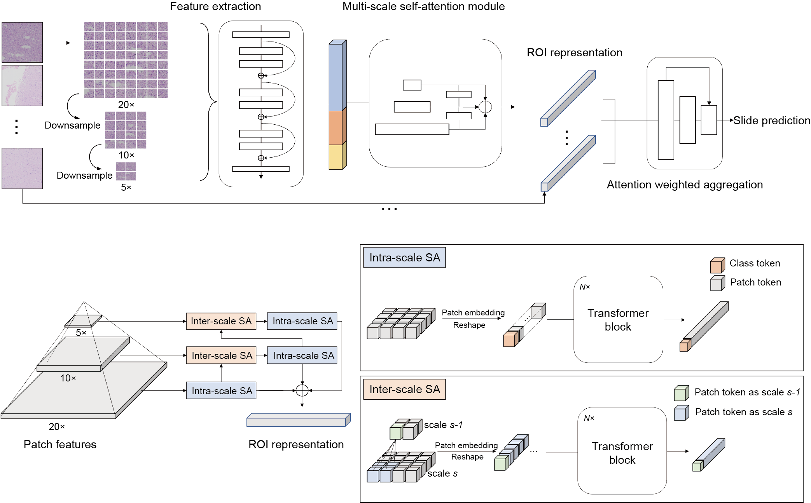

# ROAM
A weakly supervised computational pathology method for clinical-grade auxiliary diagnosis and molecular-morphological biomarker discovery of gliomas



# Pre-requisites:
Python (3.8.13), h5py (3.6.0), openslide (version 3.4.1), opencv (version 4.5.5), pillow (version 6.2.1), Pytorch (version 1.12.1), scikit-learn (version 1.0.2), matplotlib (version 3.5.2) and seaborn (version 0.11.2).

# Instructions
We provide the complete process of using ROAM. You can modify related config files and parameters to train ROAM with your own dataset.
## Data prepare 
The first step is to prepare training dataset. The WSI data should be first segmented to several patches (ROI in ROAM, size is $2048\times2048$). Patches are then cropped from each ROI and put into pre-trained model to extract features. All the features of patches within a WSI form a bag for training.

WSI data and corresponding detailed information (.csv file) shoule be ready.
The format of digitized whole slide image data should be standard formats (.svs,.tiff etc.) that can be read with openslide (version 3.4.1).

Here is an example of directory for WSI data.
```bash
DATA_DIRECTORY
      |____ slide1.tiff
      |____ slide2.tiff
      |____ ...
```

The corresponding information data of WSI (.csv) should include key information such as `slide_id`,`path`,`label`. Here is an example:

|slide_id|path|label|level|
|-|-|-|-|
|965c821d05bbec8|/images/202007/965c821d05bbec8.tif|2|20x|

`level` is the magnification level of the slide. More information can be added to facilitate the process of the data. We provide an example csv file in `./data_prepare/data_csv/`.


#### 1.WSI segmentation and patching

The first step is to segment the tissue and crop patches from the tissue region. We referenced CLAM's WSI processing method. CLAM provide a robust WSI segmentation and patching implementation. You can refer to [CLAM](https://github.com/mahmoodlab/CLAM) for more detailed information.

You can segment the tissue region and crop patches by running the following command in `./data_prepare/` directory:
```shell
python create_patches_fp.py --source DATA_DIRECTORY --datainfo DATA_INFO_DIRECTORY --patch_size 2048 --step_size 2048 --save_dir PATCH_DIRECTORY --patch_level 0
```
The description of parameters is listed as follow:

`--source`：path to raw wsi data  
`--datainfo`: data information of WSI data  
`--patch_size`: size of patch  
`--step_size`: step size of patching, "patch_size == step_size" denotes patches are extracted without overlapping  
`--save_dir`: path to save results  
`--patch_level`: downsample level at which to crop patches 

The above commond will segment all WSIs in DATA_INFO_DIRECTORY (.csv file), crop patches within the tissue regions with the size of 2048 and generate the following folder structure:
```bash
PATCH_DIRECTORY
      |____ masks
            |__ slide1.jpg
            |__ slide2.jpg
            |__ ...
      |____ patches
            |__ slide1.h5
            |__ slide2.h5
            |__ ...
      |____ stitches
            |__ slide1.jpg
            |__ slide2.jpg
            |__ ...
      |____ process_list_autogen.csv
```
The `masks` folder contains the segmentation results (one image per slide).
The `patches` folder contains arrays of extracted tissue patches from each slide (one .h5 file per slide, where each entry corresponds to the coordinates of the top-left corner of a patch)
The `stitches` folder contains downsampled visualizations of stitched tissue patches (one image per slide) 

#### 2.Patch feature extraction
  
For each ROI (patch with size of $2048\times2048$), you need extract features of patches (usually $256\times256$) within each ROI at three distinct magnification levels (20x,10x,5x). Then the fearures can be put into the ROAM model for training.

Run the following commond in `./data_prepare/` directory for feature extraction:
```bash
python extract_feature_patch.py --data_h5_dir PATCH_DIRECTORY --data_slide_dir DATA_DIRECTORY --csv_path DATA_INFO_DIRECTORY --feat_dir FEAT_DIRECTORY --pretrained_model ImageNet --stain_norm
```

Parameters:  
`--feat_dir`: directory to save features results.  
`--pretrained_model`: pre-trained model to extract patch features. "ImageNet","RetCCL","ctranspath","simclr-ciga" are available models. "ImageNet" denotes ResNet50 pretrained with ImageNet. Other 3 models are self-supervised models for pathological images. You can refer to [RetCCL](https://github.com/Xiyue-Wang/RetCCL), [ctranspath](https://github.com/Xiyue-Wang/TransPath), [simclr-ciga](https://github.com/ozanciga/self-supervised-histopathology) for model checkpoint and detailed information.  
`--is_stain_norm`: whether to use stain normalization

The above commond will generate features with following folder structure:
```bash
FEAT_DIRECTORY
      |____ feats_ImageNet_norm
            |__ slide1.h5
            |__ slide2.h5
            |__ ...
```
Each .h5 file contains an array of extracted features and corresponding coordinates. Features shape of each ROI is $84\times d$. 84 represents each ROI with size of 2048 can be cropped into 84 patches with size of 256 and $d$ denotes feature dimension, which depends on the pre-trained model.


#### 3.Generate splits
ROAM employs a 5-fold cross validation on the training dataset, followed by testing the ensemble of the 5 trained models on the test dataset.
The format of splits data is .npy file. The file contains the training and validation set splits for each fold.

Each fold contains train list, train labels, val list and val labels:
```
([train_slide_id1,train_slide_id2,...,train_slide_idk],[train_label1,train_label2,...,train_labelk],  
[val_slide_id1,val_slide_id2,...,train_slide_idm],[val_label1,val_label2,...,val_labelm])
```

We provide examples of splits in `./data_prepare/data_split`


## Training ROAM models

#### 1.training
With features data and splits, you can start training your own ROAM models.

You should first prepare **config file** and **script file**. You can easily modify the parameters in **config files** and then list training commond in **script file**. Run the script file to train ROAM models. It can effectively standardizes the code training, avoiding the need to input lengthy training commands.

**config file** (.ini file) is created in the `./ROAM/configs` folder. Here we list some of the main parameters. For more detailed settings, please refer to `./ROAM/parse_config.py`:  
```ini
[int_glioma_tumor_subtyping] #task

seed=1 #initial random seed for traininng
stage=train #train or test
embed_type=ImageNet #pre-trained model that features are extracted
not_stain_norm=False #whether to use stain-noramlized features
data_root_dir=FEAT_DIRECTORY #directory of features
results_dir=RESULT_DIRECTORY #directory to save final results
...
```

You can define your own task in `./ROAM/parse_config.py`. Here is an example of task in our experiments:
```python
task_info={
      'int_glioma_tumor_subtyping':{
            'csv_path': DATA_INFO_DIRECTORY,
            'label_dict': {0:0,1:1,2:2,3:2,4:2}, # map the original labels to the labels required for this task
            'n_classes': 3, # number of classes
            'split_dir': '../data_prepare/data_split/int_glioma_tumor_subtyping.ini', # training splits
            'test_split_dir':  '../data_prepare/data_split/int_glioma_tumor_subtyping_test.ini', # test splits
            'cls_weights': [50,24,514], # the proportion of each class in the training dataset, for class balance when generating dataloader.
      }
}
```


We also provide examples for reference: `./ROAM/configs/int_glioma_tumor_subtyping.ini`. Please note that the parameters in the config file must be defined in `parse_config.py`.

**script file** (.sh file) is created in `./ROAM/scripts` folder. You need only provide config file, splits seed and experiment name (can be omitted). Here is an example of `./ROAM/scripts/int_glioma_tumor_subtyping.sh`:
```bash
cd ..
python main.py configs/int_glioma_tumor_subtyping.ini s1 example1
python main.py configs/int_glioma_tumor_subtyping.ini s2 example2
```

The script indicates that we conduct 2 experiments using 2 different splits seed. The split seed refers to the random seed number used for dividing the training and val splits. 
We conducted five experiments with different split seeds (denoted as s0 to s4) to enhance the robustness and credibility of the experimental results in the paper.

With config file and script file, you can train ROAM models with following commond in `./ROAM/scrits/` directory:

```bash
CUDA_VISIBLE_DEVICES=0 sh int_glioma_tumor_subtyping.sh
```

#### 2.Cascade diagnosis

#### 3.Ablation experiments


## Visualization

