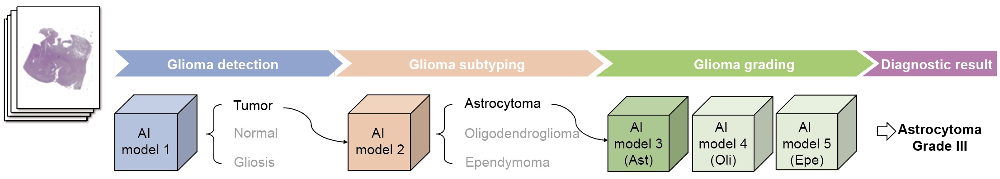

# ROAM
A weakly supervised computational pathology method for clinical-grade auxiliary diagnosis and molecular-morphological biomarker discovery of gliomas


# Pre-requisites:
Python (3.8.13), h5py (3.6.0), openslide (version 3.4.1), opencv (version 4.5.5), pillow (version 6.2.1), Pytorch (version 1.12.1), scikit-learn (version 1.0.2), matplotlib (version 3.5.2) and seaborn (version 0.11.2).


# Installation guide
We recommend that you use anaconda to configure ROAM’s dependency environment. You can refer to https://www.anaconda.com/distribution/ to download and install the anaconda corresponding to the python version you are using.

Use the environment configuration file located in `./docs/environment.yaml` to create a conda environment:
```shell
conda env create -n roam -f docs/environments.yaml
```
Activate the roam environment to run the training code:
```shell
conda acivate roam
```
If an error occurs when importing h5py, you can try uninstalling and then reinstalling the package.
```shell
pip uninstall h5py
pip install --no-cache-dir h5py
```

# Instructions
We provide the complete process of using ROAM. You can modify related config files and parameters to train ROAM with your own dataset.
We provide slide example and trained models for reproducibility. The detailed information can be found in [slide examples](#slide-examples) and [model checkpoints](#model-checkpoint).
## Data prepare 
The first step is to prepare training dataset. The WSI data should be first segmented to several patches (ROI in ROAM, size is $2048\times2048$). Patches are then cropped from each ROI and put into pre-trained model to extract features. All the features of patches within a WSI form a bag for training.

WSI data and corresponding detailed information (.csv file) shoule be ready.
The format of digitized whole slide image data should be standard formats (.svs,.tiff etc.) that can be read with openslide (version 3.4.1).

Here is an example of directory for WSI data.
```bash
DATA_DIRECTORY
      |____ slide1.tiff
      |____ slide2.tiff
      |____ ...
```

The corresponding information data of WSI (.csv) should include key information such as `slide_id`,`path`,`label`. Here is an example:

|slide_id|path|label|level|
|-|-|-|-|
|965c821d05bbec8|/images/202007/965c821d05bbec8.tif|2|20x|

`level` is the magnification level of the slide. More information can be added to facilitate the process of the data. We provide an example csv file in `./data_prepare/data_csv/`.


#### 1.WSI segmentation and patching

The first step is to segment the tissue and crop patches from the tissue region. We referenced CLAM's WSI processing method. CLAM provide a robust WSI segmentation and patching implementation. You can refer to [CLAM](https://github.com/mahmoodlab/CLAM) for more detailed information.

You can segment the tissue region and crop patches by running the following command in `./data_prepare/` directory:
```shell
python create_patches_fp.py --source DATA_DIRECTORY --datainfo DATA_INFO_DIRECTORY --patch_size 4096 --step_size 4096 --save_dir PATCH_DIRECTORY --patch_level 0 --seg --stitch --patch
```
The description of parameters is listed as follow:

`--source`：path to raw wsi data  
`--datainfo`: data information of WSI data  
`--patch_size`: size of patch  
`--step_size`: step size of patching, "patch_size == step_size" denotes patches are extracted without overlapping  
`--save_dir`: path to save results  
`--patch_level`: downsample level at which to crop patches  
`--seg,--stitch,--patch`: Indicate whether to split the slides, whether to concatenate the segmengted patches to observe the segmentation effect, and whether to extract patches.


The above commond will segment all WSIs in DATA_INFO_DIRECTORY (.csv file), crop patches within the tissue regions with the size of 2048 and generate the following folder structure:
```bash
PATCH_DIRECTORY
      |____ masks
            |__ slide1.jpg
            |__ slide2.jpg
            |__ ...
      |____ patches
            |__ slide1.h5
            |__ slide2.h5
            |__ ...
      |____ stitches
            |__ slide1.jpg
            |__ slide2.jpg
            |__ ...
      |____ process_list_autogen.csv
```
The `masks` folder contains the segmentation results (one image per slide).
The `patches` folder contains arrays of extracted tissue patches from each slide (one .h5 file per slide, where each entry corresponds to the coordinates of the top-left corner of a patch)
The `stitches` folder contains downsampled visualizations of stitched tissue patches (one image per slide) 

Please note that the slide example we provide was obtained at a magnification level of 40x. The actual size of the ROI extracted is $4096\times4096$, which corresponds exactly to the size of $2048\times2048$ under 20x magnification. This will not affect the subsequent feature extraction process, as we have standardized the ROI size to 2048 during feature extraction, eliminating the need for additional processing.

When utilizing your own dataset, remember to guarantee that the size of extracted ROI is $2048\times2048$ at 20x magnification level.


#### 2.Patch feature extraction
  
For each ROI (patch with size of $2048\times2048$), you need extract features of patches (usually $256\times256$) within each ROI at three distinct magnification levels (20x,10x,5x). Then the fearures can be put into the ROAM model for training.

Run the following commond in `./data_prepare/` directory for feature extraction:
```bash
python extract_feature_patch.py --data_h5_dir PATCH_DIRECTORY --data_slide_dir DATA_DIRECTORY --csv_path DATA_INFO_DIRECTORY --feat_dir FEAT_DIRECTORY --pretrained_model ImageNet --is_stain_norm
```

Parameters:  
`--feat_dir`: directory to save features results.  
`--pretrained_model`: pre-trained model to extract patch features. "ImageNet","RetCCL","ctranspath","simclr-ciga" are available models. "ImageNet" denotes ResNet50 pretrained with ImageNet. Other 3 models are self-supervised models for pathological images. You can refer to [RetCCL](https://github.com/Xiyue-Wang/RetCCL), [ctranspath](https://github.com/Xiyue-Wang/TransPath), [simclr-ciga](https://github.com/ozanciga/self-supervised-histopathology) for model checkpoint and detailed information.  
`--is_stain_norm`: whether to use stain normalization

The above commond will generate features with following folder structure:
```bash
FEAT_DIRECTORY
      |____ feats_ImageNet_norm
            |__ slide1.h5
            |__ slide2.h5
            |__ ...
```
Each .h5 file contains an array of extracted features and corresponding coordinates. Features shape of each ROI is $84\times d$. 84 represents each ROI with size of 2048 can be cropped into 84 patches with size of 256 and $d$ denotes feature dimension, which depends on the pre-trained model.

We provide some model codes that may be needed for feature extraction in ``data_prepare/models/`, including "ImageNet","RetCCL","simclr-ciga", etc. The corresponding checkpoint files can be downloader from [pretrained model weights](https://drive.google.com/drive/folders/1afjdbW31QCq5HjV7oe7AdcMAHAav_AdO?usp=drive_link).


#### 3.Generate splits
ROAM employs a 5-fold cross validation on the training dataset, followed by testing the ensemble of the 5 trained models on the test dataset.
The format of splits data is .npy file. The file contains the training and validation set splits for each fold.

Each fold contains train list, train labels, val list and val labels:
```
## fold 1
(
      [train_slide_id1,train_slide_id2,...,train_slide_idk],
      [train_label1,train_label2,...,train_labelk],  
      [val_slide_id1,val_slide_id2,...,train_slide_idm],
      [val_label1,val_label2,...,val_labelm]
)
## fold 2
...

```

For test split, the format of split data is:
```
np.array([
      [test_slide_id1,test_slide_id2,...,test_slide_idk],
      [test_label1,test_label2,...,test_labelk]
])
```
We provide examples of splits in `./data_prepare/data_split/`


## Training ROAM models

#### 1.training and test
With features data and splits, you can start training your own ROAM models.

You should first prepare **config file** and **script file**. You can easily modify the parameters in **config files** and then list training commond in **script file**. Run the script file to train ROAM models. It can effectively standardizes the code training, avoiding the need to input lengthy training commands.

**config file** (.ini file) is created in the `./ROAM/configs` folder. Here we list some of the main parameters. For more detailed settings, please refer to `./ROAM/parse_config.py`:  
```ini
[int_glioma_tumor_subtyping] #task

seed=1 #initial random seed for traininng
stage=train #train or test
embed_type=ImageNet #pre-trained model that features are extracted
not_stain_norm=False #whether to use stain-noramlized features
data_root_dir=../data_prepare/FEAT_DIRECTORY #directory of features
results_dir=RESULT_DIRECTORY #directory to save final results
...
```
**About 'data_root_dir'**: Please note that codes for model training and feature extraction aren't executed under the same
 root directory. Feature extraction is in `data_prepare`, and training is in `ROAM`. Therefore, providing the relative path 
 to the original extracted feature (FEAT_DIRECTORY) would cause an error. You can either use absolute paths or prepend `../data_prepare` to the path.  
 For example, we set `FEAT_DIRECTORY=./example`, then `data_root_dir` should be `../data_prepare/example`.


You can define your own task in `./ROAM/parse_config.py`. Here is an example of task in our experiments:
```python
task_info={
      'int_glioma_tumor_subtyping':{
            'csv_path': DATA_INFO_DIRECTORY,
            'label_dict': {0:0,1:1,2:2,3:2,4:2}, # map the original labels to the labels required for this task
            'n_classes': 3, # number of classes
            'split_dir': '../data_prepare/data_split/xiangya_split_subtype/example_int_glioma_tumor_subtyping.npy', # training splits
            'test_split_dir':  '../data_prepare/data_split/xiangya_split_subtype/example_test_split.npy', # test splits
            'cls_weights': [50,24,514], # the proportion of each class in the training dataset, for class balance when generating dataloader.
      }
}
```


We also provide examples for reference: `./ROAM/configs/int_glioma_tumor_subtyping.ini`. Please note that the parameters in the config file must be defined in `parse_config.py`.

**script file** (.sh file) is created in `./ROAM/scripts` folder. You need only provide config file, splits seed and experiment name (can be omitted). Here is an example of `./ROAM/scripts/int_glioma_tumor_subtyping.sh`:
```bash
cd ..
python main.py configs/int_glioma_tumor_subtyping.ini s1 example1
python main.py configs/int_glioma_tumor_subtyping.ini s2 example2
```

The script indicates that we conduct 2 experiments using 2 different splits seed. The split seed refers to the random seed number used for dividing the training and val splits. 
We conducted five experiments with different split seeds (denoted as s0 to s4) to enhance the robustness and credibility of the experimental results in the paper.

**training**  
With config file and script file, you can train ROAM models with following commond in `./ROAM/scripts/` directory:

```bash
CUDA_VISIBLE_DEVICES=0 sh int_glioma_tumor_subtyping.sh
```

**Results saving**
The code will automatically save the best-performing model and evaluation metrics for each fold during the training process.
The results will be saved in `{result_dir}/{task}/{exp_code}/{seed}`.  
`results_dir` is the root directory to save results.  
`task` is the task name of the experiment. For example, we provide a example task "int_glioma_tumor_subtyping".  
`seed` is the random seed of this experiment. These three parameters can be set in the config file. You can refer to `./ROAM/configs/int_glioma_tumor_subtyping.ini`  
`exp_code` is the code name of this experiment. You can either customize it or use the default name. You can set "exp_code" in training script file. For example, we provide a example script file: `scripts/int_glioma_tumor_subtyping.sh`:
```bash
python main.py configs/int_glioma_tumor_subtyping.ini s1 exp_code #you can remove the exp_code to use the default setting
```
The details of default "exp_code" can be found in parse_config.py:
```python
args.exp_code = '_'.join(map(str, [args.task, args.depths,
                                       args.embed_type,
                                       args.batch_size, args.roi_dropout, 
                                       args.roi_supervise,
                                       args.roi_weight, args.topk,
                                       args.roi_level,
                                       args.scale_type,args.single_level,
                                       args.not_interscale]))
```

Here we provide an example folder structure of saved results:
```bash
results
      |____ int_glioma_tumor_subtyping
            |____ int_glioma_tumor_subtyping_[2, 2, 2, 2, 2]_ImageNet_4_True_True_1.0_4_0_ms_0_False
                  |____ s1
                        |____ visual_res
                              |__ cm_mean.png # confusion matrix on test dataset
                              |__ normal_cm_mean.png
                              |__ metrics.json # resutls summary
                        |____ ROAM_split0.pth #model checkpoints for each fold
                        |____ ROAM_split1.pth
                        |____ ROAM_split2.pth
                        |____ ROAM_split3.pth
                        |____ ROAM_split4.pth
                        |____ results.json #complete results, including probs,preds,... of each fold
```
If you want to run the testing and visualization code using the example model weights we provide, 
please download the five model weights and place them according to the folder structure outlined above.

**test**  
You can also test the model performance with following commond:
```bash
CUDA_VISIBLE_DEVICES=0 sh int_glioma_tumor_subtyping_test.sh
```

#### 2.Cascade diagnosis


You can also use ROAM for cascode diagnosis. Take glioma diagnosis as an example, all you need to do is running the tasks for glioma detection, glioma subtyping and glioma grading sequentially. 'predict_cascade.py' will automatically generate the test set data required for the subsequent tasks based on teh current prediction resutls.

Configure file is the same as the configure file in the training section. Here is an example of the script for cascade diagnosis:
```bash
cd ..
python predict_cascade.py configs/int_glioma_cls.ini s1 #for glioma detection
python predict_cascade.py configs/int_glioma_tumor_subtyping.ini s1 #for glioma subtyping
python predict_cascade.py configs/int_ast_grade.ini s1 #for astrocytoma grading
python predict_cascade.py configs/int_oli_grade.ini s1 #for oligodendroglioma grading
python predict_cascade.py configs/int_epe_grade.ini s1 #for ependymoma grading
```
The results will be saved in `./ROAM/prediction_results/` by default.

Then run the script to generate the complete diagnosis resutls in `./ROAM/scripts/`:
```bash
CUDA_VISIBLE_DEVICES=0 sh cascade_pred.sh
```

#### 3.Ablation experiments

You can also try ablation experiments to validate ROAM's performance in `./ROAM/ablations`. 

## Visualization

We provide both **slide-level** and **roi-level** visualization methods. 

**slide-level visualization**  
We generate WSI attention heatmap using attention score of each roi. Config file and visualization results are saved in `./ROAM/visheatmaps/slide_vis`.

Run the following commond to generate slide-level visualization results:
```python
python gen_visheatmaps_slide_batch.py config_int_glioma_tumor_subtyping.yaml s1
```

config file should be in `./ROAM/visheatmaps/slide_vis/configs/` and 's1' is split seed.

**roi-level visualization**  
ROI-level visualization is performed through calculate gradients of patch tokens in the self-attention matrix. For more detailed information you can refer to [Transformer-Explainability](https://github.com/hila-chefer/Transformer-Explainability) and [vision-transformer-explainability](https://github.com/jacobgil/vit-explain). Config file and visualization results are saved in `./ROAM/visheatmaps/roi_vis`.


Run the following commond to generate roi-level visualization resutls:
```python
python gen_visheatmaps_roi_batch.py visheatmaps/roi_vis/configs/int_glioma_tumor_subtyping_vis_roi.ini s1
```

## slide examples
For reproducability, we provide a oligodendroglioma slide example and its corresponding feature extracted from ImageNet pretrained ResNet50.
The slide and feature can be downloaded from: [slide examples](https://drive.google.com/drive/folders/1u1_B7WkRAxIW38WmPq9hZ_tN3pxKnSVP?usp=drive_link)

With its corresponding test split: 
      `./data_prepare/data_split/xiangya_split_subtype/example_test_split.npy`
data infomation:
      `./data_prepare/data_csv/example_xiangya_data_info_pro.csv`
and configure, script file, you can test the ROAM model with the example slide.

## Model checkpoint
For reproducability, we provide 5 trained models with 5 different split seeds for glioma subtyping task. 

Model checkpoints: [model_ckpt](https://drive.google.com/drive/folders/1fi_OWsR9jlmFgx2uBdPOO5vwsHAy4WH8?usp=drive_link)

## Visualization examples
Here are some examples of visualization results.


# Update
## 2024.03.12
1.Add the pretrained model codes in `data_prepare/models` and provide the corresponding checkpoints.

2.Add another 2 dependencies: spams(version 2.6.5.4) and torchsummary(version 1.5.1).

3.Update the command of WSI segmentation and patching.
