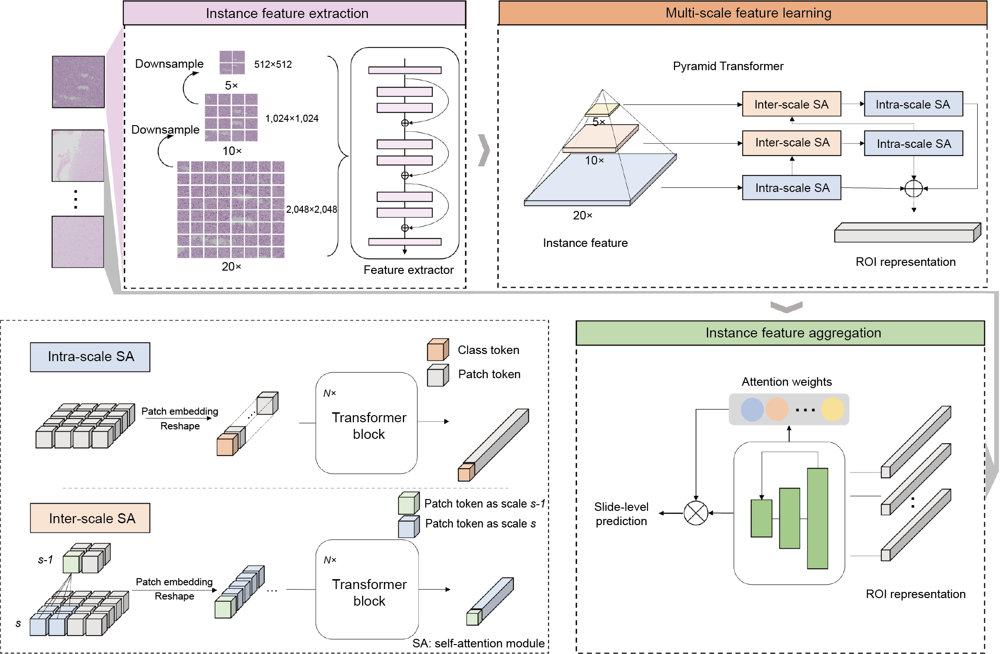

# ROAM
A weakly supervised computational pathology method for clinical-grade auxiliary diagnosis and molecular-morphological biomarker discovery of gliomas



# Instructions
We provide the complete process of using ROAM. You can modify related config files and parameters to train ROAM with your own dataset.
## Data prepare 
The first step is to prepare training dataset. The WSI data should be first segmented to several patches (ROI in ROAM, size is 2048*2048). Patches are then cropped from each ROI and put into pre-trained model to extract features. All the features of patches within a WSI form a bag for training.

For 

* WSI segmentation and patching


```bash
DATA_DIRECTORY
      |____ slide1.tiff
      |____ slide2.tiff
      |____ ...
```

## Training with ROAM


